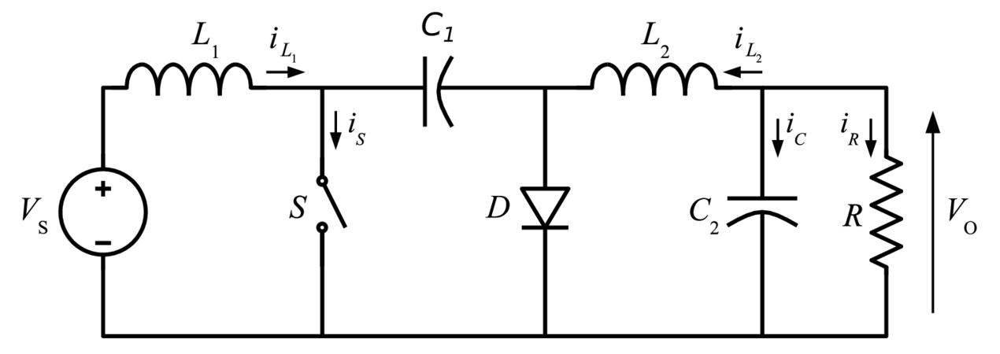
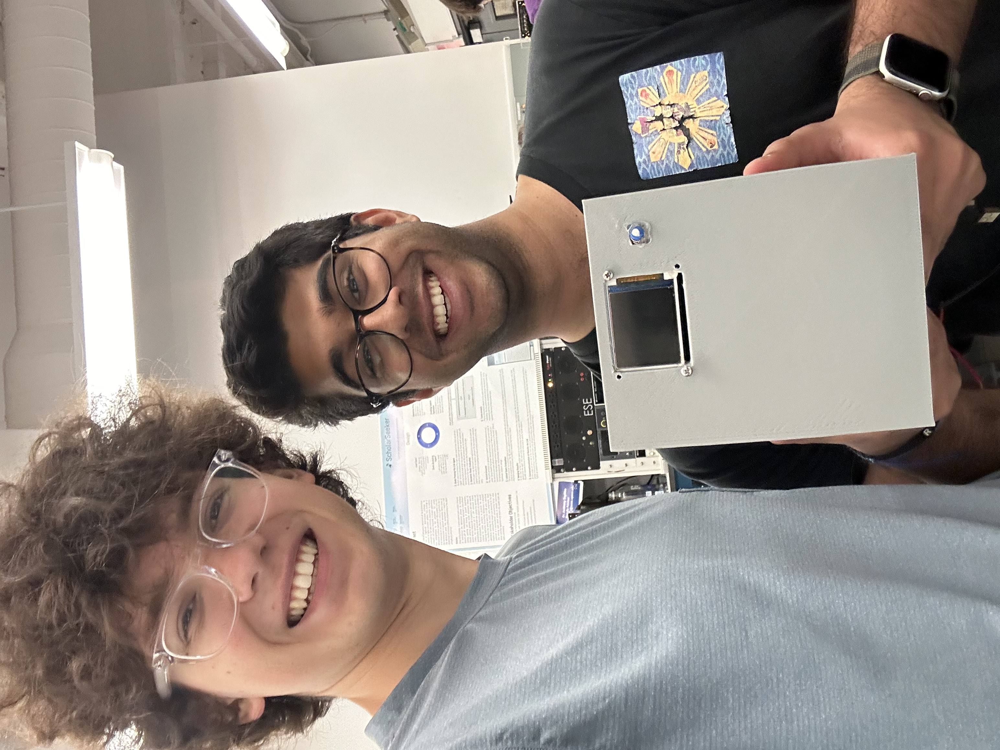

# Rohan and Owen: SCR-Based Rectifier

    * Team Name: Sid's Kids
    * Team Members: Rohan Panday and Owen Ledger
    * Github Repository URL: <https://github.com/ese3500/final-project-sid-s-kids>
    * Github Pages Website URL: https://ese3500.github.io/final-project-sid-s-kids/
    * Description of hardware: (embedded hardware, laptop, etc): MacOS Sonoma, Macbook Pro with M1 Chip, Dell Inspring with Intel I7 evo

## Final Project Report

This page documents Owen and Rohan's journey through our ESE 3500 Project, and boy, was it a journey. If you look at the bottom of this page (where we highlighted the features and plan for our demo), you will see that the execution of this project was different. Regardless here is an overview of our final project, from the initial conception to the final implementation.

When we began ideating final project topics, since we are both in ESE 5800 (Power Electronics), we decided to implement a power converter, using a microcontroller as the controller for the power converter. We decided to implement an AC-DC converter, whereby a user could plug in an AC source, set a target output DC voltage, and have the microcontroller calculate values and control the switches in the power converter.

Our initial plan was to implement the AC-DC converter using Silicon Controlled Rectifiers to create a rectifier. This would allow the user to take in an AC voltage with amplitude Vin, and output any voltage within the range +Vin to -Vin. This rectifier has the following basic schematic, and requires two different firing angles to control the rectifiers:

Our components took almost two weeks to arrive, and so it took a while for us to test the SCRs using an ATMega. When we were able to do that, we realized a few key issues. Firstly, isolation between the high-side AC and low-side DC was quite challenging, especially as it pertained to applying a voltage accross the SCR to properly allow it to turn on. Secondly, SCRs are current controlled devices, and the current required to run more than 1 or 2 SCRs was beyond the capabilites of the ATMega. We tried to correct both of these issues with different types of isolation as well as a push-pull amplifier to increase the current, but the amount of hardware needed to get this system to work was exceedingly high, especially due to in-rush current requirements.

As such, we decided to change the implementation of the AC-DC converter. We decided to instead implement the rectifier using a simple full-bridge rectifier, and then the output of the rectifier feeds into a Ćuk converter, which is a type of buck-boost converter. This allows, us to have similar functionality to what we wanted before (a range of output values). The only differences in this case are that we have inverted output voltages, and the output voltages can be both lower and higher than the input. The topologies used can be seen below:

The full-bridge converter has a transfer function that maps an AC signal with an amplitude of Vin to $\frac{2 \cdot Vin}{\pi}$. The Ćuk converter has a transfer function of $\frac{Vout}{Vin} = \frac{D}{1-D}$.

The control of this converter was done using the ATMega to vary D depending on the input voltage and the target output voltage. In particular, it does it using a PID controller. PID stands for Proportional-Integral-Derivative control, which means that we essentially use a running error function that is the sum of proportional, integral, and derivative terms. The 3 types of terms have the following affects on the different characteristics of the control variable:

In implementing our project, we found that proportional control did the majority of the heavy lifting in getting the duty cycle to the target value, and we tuned the Kp coefficient as needed. However, we were noticing some overshoot and slow settling time. As such, we decided to add a derivative term as well to make the transition faster. This change allowed us to meet our HRS goals easily, and in fact, we found through some tuning and experimentation that the integral term had little to no effect on the response, so for simplicity we made the value of the Ki coefficient 0.

The final code we used can be seen in ESE3500_final_code_main.c for the PID code and the ESE3500_final_code_display.c for the LCD display.

### 1. Video

Above is a demonstration of the closed loop PID control of the rectifier to Cuk converter topology employed in this final project. An input voltage is varied while the duty cycle (pink) and output DC voltage (yellow) is monitored on an oscilloscope. The two primary functionalities of the device are represented in the following order. Firstly, the input voltage is held constant and the desired set-point of the output is varied by turning a potentiometer. In response, the device varies the duty cycle of the switching buck-boost converter to reach the desired set point. Given a maximum of a 2V shift at any time, the system will reach duty cycle equilibrium within one second. Further PID tuning can be employed in order to lower that time for a wider range of values. Note, the output voltage is measured as negative by the oscilloscope because it is measure relative to the internal ground of the system. The output of the system is actually flipped such that it outputs positive voltages. This does not pose a grounding issue because the input is an isolated AC input whose negative line is decoupled from the internal "world ground" of the system. The second functionality of the system is then shown. This demonstration changes the input voltage of the system to show that the system can accommodate by changing the duty cycle to reach the set point given that the input voltage is enough -- more than 1/4th the set point or less than 10x depending on if the system is boosting or bucking respectively. This performance mode also can manage a 2V shift in under 1 second, and this can be quickened by further PID tuning (i.e. cranking those numbers up). The following mode is not demonstrated in the video, but was tested rigorously after demo day. The device can support a load of minimum 200ohms. If the load is lower, the device will fall into discontinuous conduction mode which will change the conversion ratio of the converter. The PID would still be able to get in the vicinity, but the ratio that is used for math in the code will no longer apply, de-optimizing and falling out of spec that the device promises. Loads above 200ohms are viable, but it is important to ensure that the load can handle the expected current as the converter is not current limited. The above video was tested at 400ohms.

### 2. Images

Above is the final product with a set of input wires and a set of output wires for the AC input and DC output. There are two USB Type-A connectors to interface with the two atmegas contained within. There is a screen on one side showing the target voltage set by the adjacent potentiometer, the current voltage being outputted and the input voltage being read.

### 3. Results

The problem specs, input and outputs for our project remained the same, however, the solution to our power management challenge shifted from an SCR based rectifier to a normal diode rectifier followed by a Cuk topology buck-boost converter. This setup had identical inputs and outputs to the original SCR design with slight tradeoffs. Instead of being able to output about -12V to 12V like the SCR device could, this topology could output 0 to 24V, shifting the range to reach higher output voltages but unable to support negative values. Even with this hardware change, the fundamental function of the embedded software aspect of the project is the same. A PID loop still controls the timing of the power converter, except instead of firing angle, the Atmega controls the duty cycle of the Cuk converter.

#### 3.1 Software Requirements Specification (SRS) Results

Based on your quantified system performance, comment on how you achieved or fell short of your expected software requirements. You should be quantifying this, using measurement tools to collect data.

#### 3.1.1 Overview

The software is an integral part of a buck-boost system and manages the conversion process from 1 DC voltage to another by controlling the duty angle of MOSFET using a PID algorithm on an ATMega 328 PB microcontroller.

#### 3.1.2 Users

The software is designed for electrical engineers and technicians responsible for maintaining stable DC power supplies for applications such as DC motors.

#### 3.1.3 Definitions, Abbreviations

- **PID**: Proportional-Integral-Derivative
- **ADC**: Analog to Digital Converter
- **DC**: Direct Current
- **AC**: Alternating Current
- **Cuk Converter**: A DC to DC converter that can both buck and boost voltage
- **Buck**: To lower DC voltage, normally with a switching converter
- **Boost**: To increase DC voltage, normally with a switching converter

#### 3.1.4 Functionality

- **SRS 01**: The software shall implement a PID control algorithm to regulate the duty cycle of the MOSFETs, doing so within a 1% error.
  - Our code was able to produce the correct duty cycle with a small error. We tested several duty cycles, and we found at most a 0.3% error (at duty cycle 0.50, we got a duty cyle of 0.503).
- **SRS 02**: The software shall continuously monitor input and output voltage levels through ADCs.
  - Both of the ATMega's used monitored the input and output voltages at 125 kHz using the ADCs. The control ATMega used this information for the PID control, and the display one converted the ADC readings to the correct units and displayed them on the LCD screen.
- **SRS 03**: The software shall provide real-time response to voltage fluctuations and load conditions. Ideally, the time taken to settle after a voltage testing is within 1 second. The system should work on low loads (50 ohms or lower).
  - Through testing, we found that for a 1 volt change in input, the response time was 0.7 seconds. For the largest conversion range, the time was a bit longer (1.8 seconds). The system was not as load regulated as we wanted, as the smallest load we could use with accurate output voltages was 200 ohms.
- **SRS 04**: The microcontroller shall compute the PID equation efficiently, minimizing any computations required.
  - The PID update method has a runtime of O(1), which is as efficient as we could make it (only simple additions, subtractions, and set methods).
- **SRS 05**: The software should allow dynamic adjustment of duty cycle for varying operating conditions.
  - The software takes in the input voltage, output voltage, and target from the user, adjusting the duty cycle to match the requirements based on these 3 parameters. Based on the the input and output requirements, we can reach duty cycles from 0.05 to 0.9. Due to the op amp circuit, we can read in input voltages in the range of 0 to 15 volts, read output voltages from 0 to -30 volts, and set targets from 0 to -30 volts. The code takes the scaled values from the ADCs and adjusts them for the PID controller.
- **SRS 06**: The software must provide a mechanism for setting and tuning initial PID parameters.
- **SRS 07**: The software must include robust error handling capabilities.

#### 3.2 Hardware Requirements Specification (HRS) Results

Based on your quantified system performance, comment on how you achieved or fell short of your expected hardware requirements. You should be quantifying this, using measurement tools to collect data.

#### 3.2.1 Overview

The hardware facilitates voltage measurement and PID control loop execution for a rectifier system, utilizing an ATMega 328 PB microcontroller as the core component.

#### 3.2.2 Definitions, Abbreviations

- **PID**: Proportional-Integral-Derivative
- **SCR**: Silicon Controlled Rectifier
- **ADC**: Analog to Digital Converter
- **LCD**: Liquid Crystal Display

#### 3.2.3 Functionality

- **HRS 01**: An op-amp circuit shall be used to scale AC input voltages into the ADC's range.
- **HRS 02**: The ATMega 328 PB microcontroller shall execute the PID control loop algorithm for adjusting SCR firing angles.
- **HRS 03**: The microcontroller shall interface with voltage measurement sensors for real-time decision-making.
- **HRS 04**: The microcontroller shall manage user inputs and display system parameters on an LCD panel.
- **HRS 05**: The hardware shall send gate pulses to SCRs in a timely and rapid manner.
- **HRS 06**: The system shall use an LCD display panel for showing system parameters and user interaction.
- **HRS 07**: Safety components such as fuses and diodes shall be incorporated to protect against electrical hazards.

### 4. Conclusion

Reflect on your project. Some questions to consider: What did you learn from it? What went well? What accomplishments are you proud of? What did you learn/gain from this experience? Did you have to change your approach? What could have been done differently? Did you encounter obstacles that you didn’t anticipate? What could be a next step for this project?

## References

Fill in your references here as you work on your proposal and final submission. Describe any libraries used here.

-----

[1] L. Gu, Class Lecture, Topic: "Thyristors” ESE 5800, School of Engineering and Applied Sciences, University of Pennsylvania, Philadelphia, Pennsylvania, Feb., 7, 2024.

[2] J. G. Kassakian, D. J. Perreault, G. C. Verghese, and M. F. Schlecht, Principles of Power Electronics, 2nd ed. Cambridge: Cambridge University Press, 2023.

[3] “Control Tutorials for MATLAB and Simulink - Introduction: PID Controller Design,” ctms.engin.umich.edu. https://ctms.engin.umich.edu/CTMS/index.php?example=Introduction&section=ControlPID

[4] L. Gu, Class Lecture, Topic: "Switching Converters” ESE 5800, School of Engineering and Applied Sciences, University of Pennsylvania, Philadelphia, Pennsylvania, Feb., 7, 2024.

-----

## Final Project Proposal (for MVP/Demo)

### 1. Abstract

Our project is a rectifier that takes in an AC input (either 120 VAC from the wall stepped down to 12 VAC or a waveform generator) and use a controlled 4 silicon-controlled rectifier (SCR) rectifier to perform rectification and produce a DC output. The ATMega acts as the controller for the SCRs and performs the firing angle calculations using a PID controller to vary the firing angle as needed based on measured input and output voltages, and generate the actual firing angle pulse. The load we will drive using this controller is a DC motor.

### 2. Motivation

Portable DC power sources have a multitude of uses; whether it is instrumentation, charging batteries, or most portable/consumer electronics, DC power is needed. As Electrical Engineers, we routinely use DC Power Supplies for our work. However, the most widely available and portable power sources tend to be AC power sources (that is what comes out of the wall after all). Furthermore, since we are aiming to drive a DC motor (where we can vary the output voltage to drive the motor faster), we are essentially creating a mini DC motor controller as well, which has myriad applications.

### 3. Goals

- Create a rectifier circuit using SCRs on the prototype (this can be tested using the waveform generators in the lab)
- Design the PID controller for this
- Connect the voltage measurement sensors to the rectifier
- Implement the PID controller in software
- Implement the firing angle code on the ATMega
- Combine the firing angle code with the PID control loop

### 4. Software Requirements Specification (SRS)

The software for this project is designed to run on an ATMega 328 PB microcontroller, which acts as the controller for the rectifier. The primary function of the software is to implement a PID control algorithm that regulates the firing angle of SCRs to convert alternating current (AC) input into direct current (DC) output. The software will continuously monitor the input and output voltage levels through ADCs or differential voltage sensors and adjust the firing angle of the SCRs accordingly to maintain a stable DC output voltage, suitable for applications such as driving DC motors.

The software is required to perform high-frequency calculations to ensure real-time responses to fluctuations in input voltage and load conditions. It should efficiently compute the PID equation, enabling the microcontroller to solve for the firing angle quickly, potentially using lookup tables for inverse trigonometric functions to expedite calculations. It may need to compute some complex numbers to apply the transfer function of the output filter, though we could get around this by working with the PID controller in the laplace domain and then doing all conversions at the end. The software must generate precise firing pulses, taking into account the input AC frequency, to control the SCRs accurately. This control logic must allow for dynamic adjustment of the firing angles to cater to different operating conditions, such as changes in the load or input voltage.

Additionally, the software on the backend should be designed to provide mechanisms for setting initial PID parameters and allow for their adjustment/tuning. The software must ensure robust error handling to cope with potential hardware faults or unexpected input signals.

### 5. Hardware Requirements Specification (HRS)

This project requires a way to measure input voltages, in our case using an op-amp circuit. This circuit will be capable of shifting and scaling the input voltages into the ADC range, allowing us to measure the amplitude and frequency of the AC input voltage, and the amplitude of the output voltage.

The microcontroller, an ATMega 328 PB should be able to:

- Executing the PID control loop algorithm, requiring rapid computation to adjust the firing angles of the SCRs based on the measured input and output voltages.
- Interfacing with the voltage measurement sensors, reading and processing the sensor data to make real-time decisions.
- Managing user inputs and displaying relevant system parameters on an output interface.
- Sending gate pulses in a timely and rapid manner
- All these functions will likely require 3 timers (which the ATmega has)

The hardware will use an LCD display panel to show critical system parameters, such as:

- Input voltage amplitude and frequency.
- Current output voltage.
- Desired output voltage set by the user.

The display should allow users to interactively set the desired output voltage within a predetermined range that considers the limitations imposed by the input voltage and the firing angle possibilities, possibly using a potentiometer to set the desired output voltage.

Safety components such as fuses and diodes will be incorporated to protect both the hardware and the user from electrical hazards. These components are crucial, especially considering the potential high-voltage nature of the system's operation (at least from an embedded systems perspective).

### 6. MVP Demo

A silicon controlled rectifier circuit with at least a constant firing angle. Ideally a voltage output measurement would be included as well.

The demonstration will consist of the following: attaching an AC power source to the device either from a transformer or waveform generator and measuring the output with the device and an osciliscope in order to examine ripple and accuracy to most likely a 1/2 voltage scaling. A constant firing angle alpha will be employed at this point which will yield a preset output DC voltage. The goal of this demo is to prove that the SCR devices are working, do not short unintentionally and can handle a DC load.

The basis of the PID controller should be evident in the code, even if it isn't connected to all the sensors.

MVP Slides: <https://docs.google.com/presentation/d/1lvPgcVklSQcYiyNu-Z0bmYHBMlA3lIVZDFER-7pJIpA/edit?usp=sharing>

### 7. Final Demo

A fully closed loop PID controlled SCR voltage device that takes a target DC voltage input in and outputs such voltage.

This will be conducted by connecting the device to a DC E-load, providing it again an arbitrary input waveforem and now setting a DC output voltage with a potentiometer on the housing. The DC output voltage will be readout on an LCD as well as the target voltage and characteristics of the input waveforem to be compared with what is actually being generated and taken in by the device.

If we are able to get this part fully working, we will attempt to drive a DC motor using our controller.

### 8. Methodology

First off, we will figure out what we need, like inputs/outputs, how fast and accurate it needs to be, making sure it's safe, and deciding how we want it to look and feel for users. Then, we will work to acquire parts like SCRs, accurate sensors for voltage and current, the ATMEGA328PB Xplained Board, and some other components like an LCD screen and a potentiometer. Then, we will wire the circuit and test the rectifier circuit without the ATMega.

At the same time, we will simultaneously develop the PID control algorithm for the ATMega 328 PB microcontroller. We will be setting up how we'll retrieve data from sensors and tune the controller to keep our firing angles on point. We will use tools like MatLab to test and refine our PID control.

We're also planning to make the design user-friendly and reliable, with clear error messages and nice features on the LCD so everyone can use it. After all that, it's testing time! We'll check each part by itself and then see how they all play together, fixing any problems along the way.

Next up, we'll bring all the software and hardware together, tuning all the settings like PID coefficients, where we want our voltage to be, and the firing angles to get everything running. The last big step is making sure everything we did meets the goals we set, with tests in different conditions to see how it holds up.

And we can't forget about wrapping everything up with some solid documentation, including diagrams of how the system's put together, all the circuit details, the code, how we got it all calibrated, and every test we ran.

### 9. Components

Primary components:
* ATMEGA328PB Xplained Board
* 4 High Power Silicon Controlled Rectifier Devices
* Power inductor
* High voltage capacitor
* Voltage sensing equipment (now, it is 2 op amp circuits)
* LCD screen
* Potentiometer
* Diodes for input protection

### 10. Evaluation

There are two primary metrics by which we can evaluate our project: a boolean one, does it take in an arbitrary AC waveform within our bounds in and output a rectified regulated voltage or current based on the input given by the user. The more quantifiable way to approach this would be how fast can the system output the desired quality within some time frame. The boundaries and thresholds for this qualification will be something better understood in development, but an example would be, "the device can regulate to +/- 0.05V from target within 5 seconds" or something similar. A target, for now, before any simulation/development has begun, will be for the rectifier to be able to regulate to within 0.25V within 5 seconds.

### 11. Timeline

| **Week**            | **Task** | **Assigned To**    |
|----------           |--------- |------------------- |
| Week 1: 3/24 - 3/31 | Select and order SCRs, protection diodes, voltage sensing methods and screen. |Owen
||Begin simulation and determine LC values|          Rohan            |
| Week 2: 4/1 - 4/7   | Write gate pulse, frequency analysis and LCD code.|     Owen
|| Simulate PID control and tune for inductor and capacitor amd write code for it.              | Rohan
| Week 3: 4/8 - 4/14  | Assemble circuitry and begin integration.|           Both         |
| Week 4: 4/15 - 4/21 |  Debugging.  Housing for the device.       |          Both          |
| Week 5: 4/22 - 4/26 |   Debugging. Polish and final testing       |         Both           |

### 12. Proposal Presentation

Add your slides to the Final Project Proposal slide deck in the Google Drive.